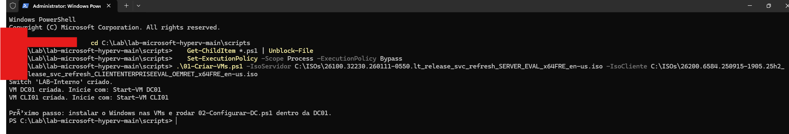
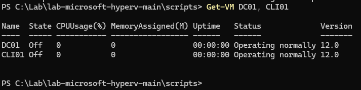
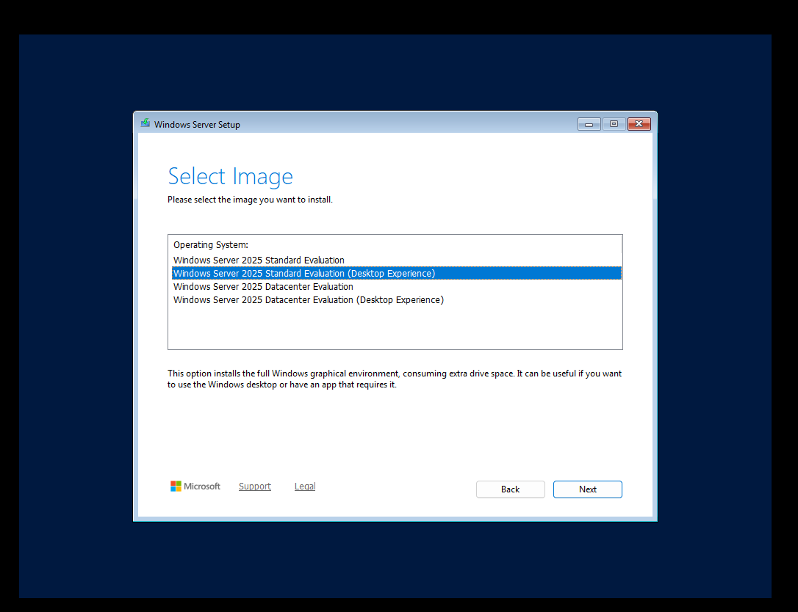
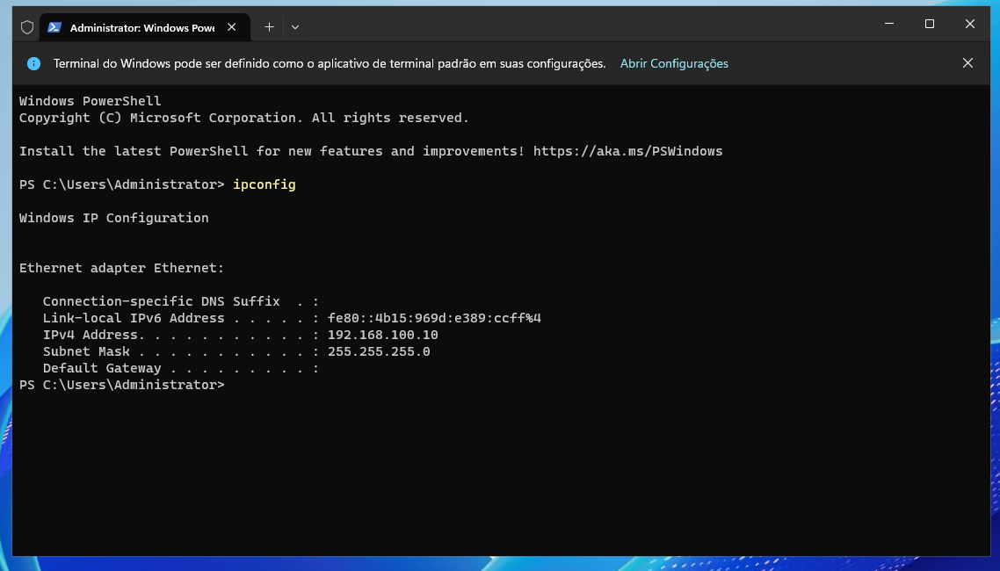
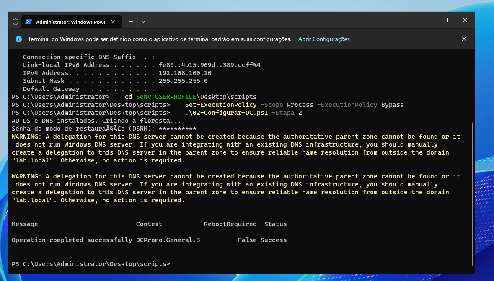
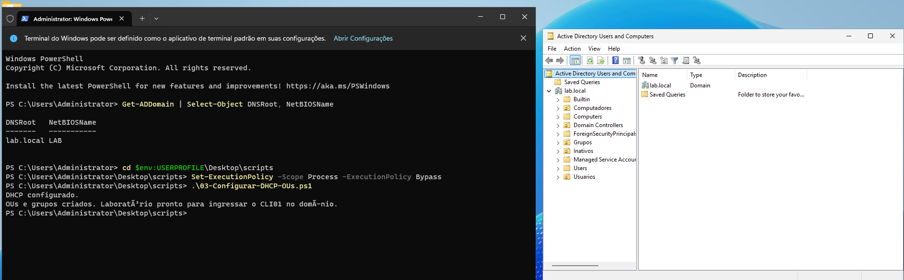
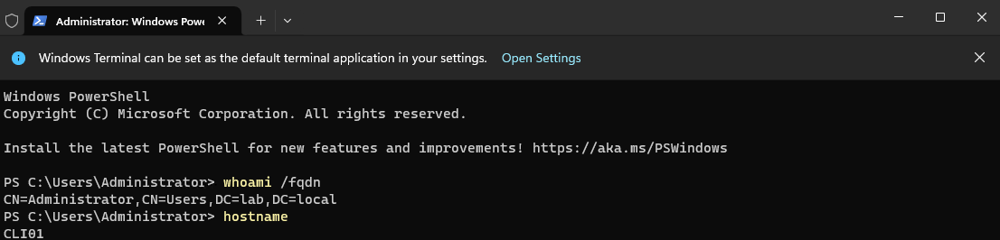
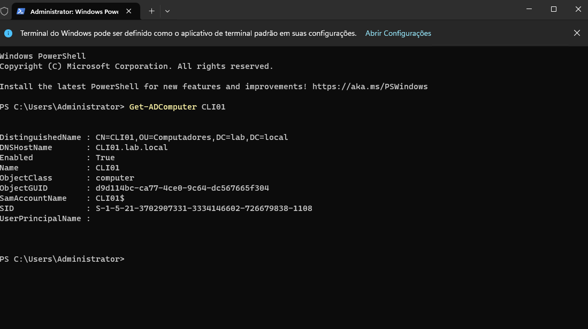

# Laboratório Microsoft no Hyper-V (AD, DNS e DHCP)

Um ambiente corporativo em miniatura, montado do zero com scripts PowerShell: um controlador de domínio com Active Directory, DNS e DHCP, e uma estação Windows ingressada no domínio.

Uso este laboratório para testar scripts (como os do projeto [ad-automation-powershell](https://github.com/warlley-santos-git/ad-automation-powershell)) sem risco para um ambiente de produção.

## Arquitetura

```
                 Host (Windows com Hyper-V)
                           │
                 Switch interno "LAB-Interno"
                    192.168.100.0/24
              ┌────────────┴─────────────┐
              │                          │
     DC01 (Windows Server)        CLI01 (Windows 11)   
     192.168.100.10 (fixo)        IP via DHCP (.100 a .200)
     AD DS · DNS · DHCP           Membro do domínio lab.local
```

| Item | Valor |
| --- | --- |
| Domínio | `lab.local` (NetBIOS `LAB`) |
| Rede | 192.168.100.0/24 |
| DC01 | 192.168.100.10, 2 GB RAM, 60 GB disco |
| CLI01 | IP via DHCP, 4 GB RAM, 60 GB disco |
| Escopo DHCP | 192.168.100.100 a 192.168.100.200 |
| OUs | Usuarios (Financeiro, TI, RH, Operacoes), Grupos, Computadores, Inativos |

## Pré-requisitos

- Windows 10/11 Pro ou Windows Server com **Hyper-V** ativado (testado no Windows 11 Pro)
- 8 GB de RAM no host (16 GB é mais confortável)
- ISOs de avaliação gratuitas do Microsoft Evaluation Center: Windows Server 2025 (180 dias) e Windows 11 Enterprise (90 dias)

## Passo a passo

| Etapa | Onde rodar | Script |
| --- | --- | --- |
| 1. Criar rede e VMs | Host | `01-Criar-VMs.ps1 -IsoServidor <iso> -IsoCliente <iso>` |
| 2. Instalar o Windows | Nas VMs | Instalação manual pela ISO |
| 3. IP fixo e nome | DC01 | `02-Configurar-DC.ps1 -Etapa 1` (reinicia) |
| 4. Criar o domínio | DC01 | `02-Configurar-DC.ps1 -Etapa 2` (reinicia) |
| 5. DHCP, OUs e grupos | DC01 | `03-Configurar-DHCP-OUs.ps1` |
| 6. Ingressar o cliente | CLI01 | `04-Ingressar-Cliente.ps1` (reinicia) |

Para copiar os scripts para dentro das VMs, use **Ação > Colar texto da área de transferência** no Hyper-V ou ative os Serviços de Integração.

Se o PowerShell bloquear a execução, libere só para a sessão atual:

```powershell
Set-ExecutionPolicy -Scope Process -ExecutionPolicy Bypass
```

## Validação

```powershell
# Na DC01
Get-ADDomain | Select-Object DNSRoot, NetBIOSName
Get-DhcpServerv4Lease -ScopeId 192.168.100.0
Get-ADComputer -Filter * | Select-Object Name, DistinguishedName

# Na CLI01
whoami /fqdn
nltest /dsgetdc:lab.local
```

## Evidências

**1. Rede e VMs criadas por script, no host**





**2. Instalação do Windows Server 2025 com interface gráfica**



**3. DC01 com IP fixo**



**4. Floresta lab.local criada (AD DS + DNS)**



**5. DHCP configurado e estrutura de OUs e grupos no AD**



**6. CLI01 no domínio, logada com conta do AD**



**7. CLI01 registrada no AD, já na OU Computadores**



## Problemas que encontrei e como resolvi

| Sintoma | Causa | Solução |
| --- | --- | --- |
| Ping da CLI01 para a DC01 falhava | O firewall do Windows Server bloqueia ping por padrão | Troquei o teste do script por DNS + porta LDAP (389); para ping no lab: `Enable-NetFirewallRule -Name FPS-ICMP4-ERQ-In` |
| CLI01 com IP 169.254.x.x e "unable to contact your DHCP server" | A DC01 estava desligada: sem DHCP, sem DNS, sem domínio | Ligar a DC01 primeiro; configurei a ordem de inicialização (abaixo) |
| Login "domain isn't available" | Mesma causa (DC desligado) e, antes, uma VLAN ativada por engano só na CLI01 | Remover a VLAN (`Set-VMNetworkAdapterVlan -VMName CLI01 -Untagged`) e ligar a DC01 |
| "The directory service is busy" ao renomear e ingressar no domínio | Renomear e ingressar na mesma operação | O script agora renomeia primeiro e ingressa com `JoinWithNewName` |
| Sem tecla `\` na tela de login | Layout de teclado US na VM | Login no formato `administrator@lab.local` e teclado ABNT2 na VM |
| Acentos embaralhados nas mensagens dos scripts | Windows PowerShell 5.1 lê UTF-8 sem BOM como ANSI | Scripts salvos em UTF-8 com BOM |

Ordem de inicialização, para o DC sempre ligar antes do cliente:

```powershell
Set-VM DC01  -AutomaticStartAction Start -AutomaticStartDelay 0
Set-VM CLI01 -AutomaticStartAction Start -AutomaticStartDelay 90
```

## Próximos passos

- [ ] Criar GPOs de exemplo (papel de parede, mapeamento de unidade, bloqueio de USB)
- [ ] Sincronizar usuários com o Microsoft Entra ID (Entra Connect Sync) usando um tenant de teste
- [ ] Gerenciar a CLI01 pelo Intune

## O que pratiquei

Instalação e promoção de controlador de domínio, DNS integrado ao AD, DHCP autorizado no AD com escopo e reserva, estrutura de OUs, grupos de segurança e automação de todo o processo com PowerShell.

---

Autor: **Warlley Santos** · [LinkedIn](https://linkedin.com/in/warlley-santos)
